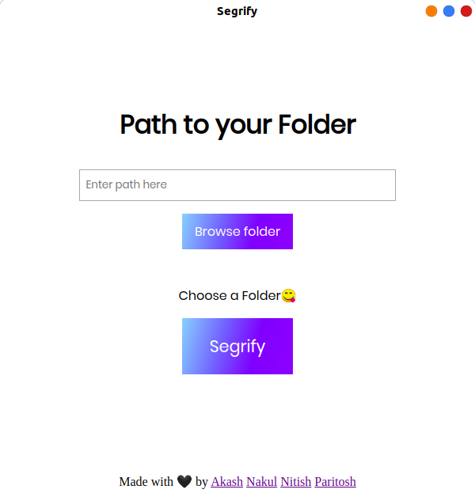

# Segrify

Segrify is a program to clean and organize your PC.



## Installation

Use the package manager [pip](https://pip.pypa.io/en/stable/) to install foobar.

```bash
pip install -r requirement.txt
```

## Usage
In paritosh_0.1.py (at the end of file)
```python
...

# give any path you want
segragete(srcpath)

...
```
Give any path you want instead of srcpath.

## License
[MIT](https://choosealicense.com/licenses/mit/)